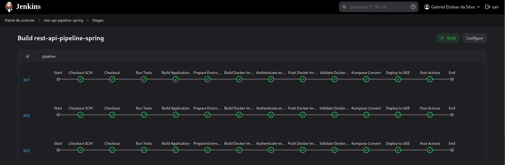

REST API SpringBoot Example 
- JWT Auth ("/user" -> create new User, "/login" -> get jwt Bearer token return on header)
- docker-compose.yml services: MysqlDB and rest-api-spring image FROM openjdk:17-jdk-slim
- Pipeline Jenkins to execute tests, package jar file, build docker image and deploy the pods in GKE after authentication with google-cloud-service-account json key.

DEPENDENCIES FOR JENKINS
The Jenkins needs Maven, Docker plugins and access in terminal:
kompose [Kompose instalations](https://kompose.io/installation/)
docker compose [Docker Desktop Instalation](https://docs.docker.com/desktop/)
gcloud [Google Cloud CLI Instalation](https://cloud.google.com/sdk/docs/install?hl=pt-br)
kubectl [Kubernates Instalation](https://kubernetes.io/docs/tasks/tools/)